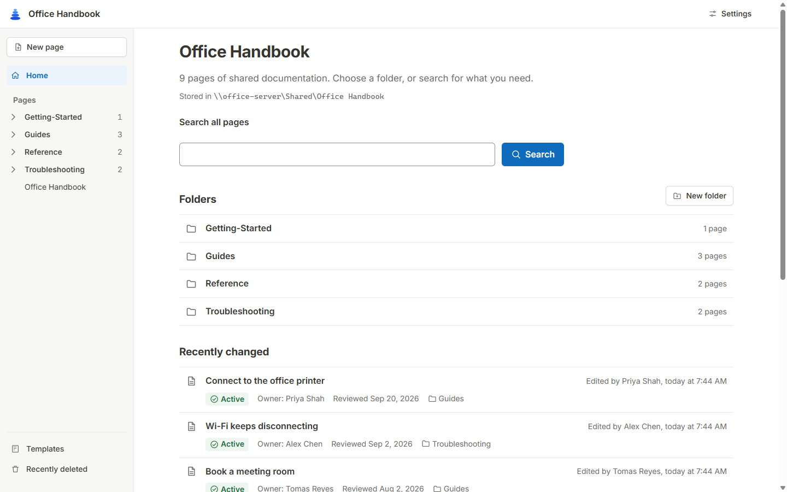
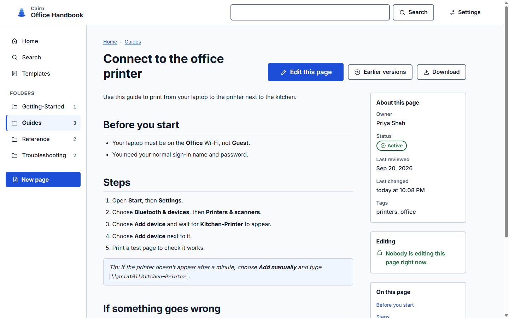
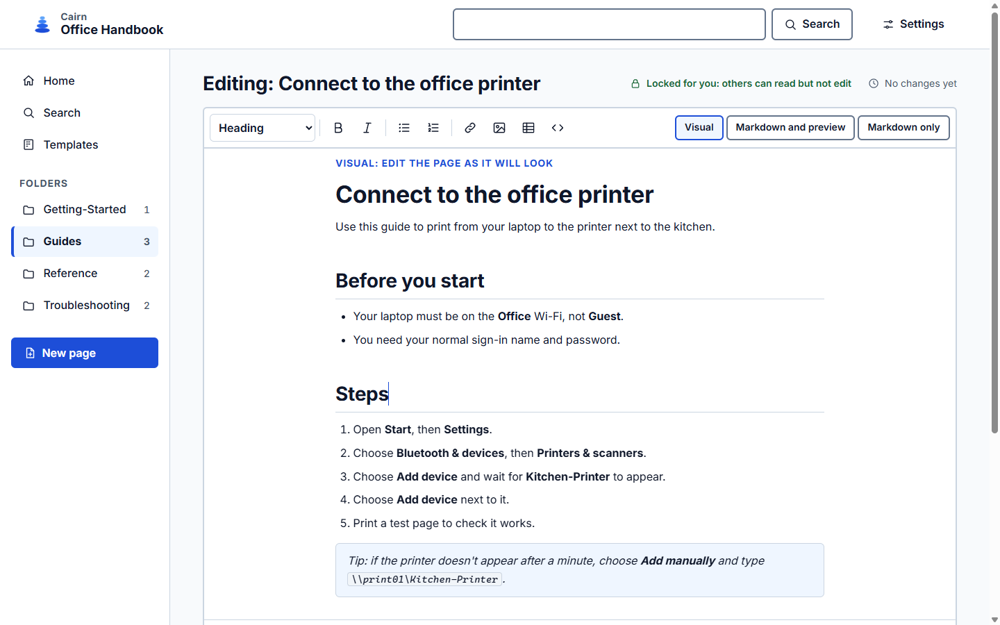
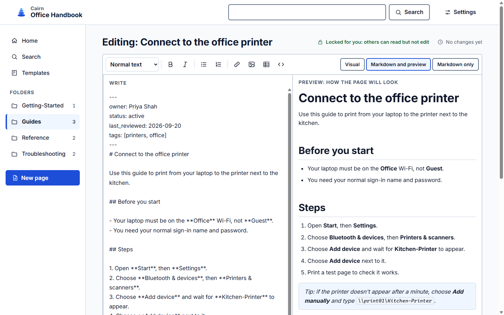
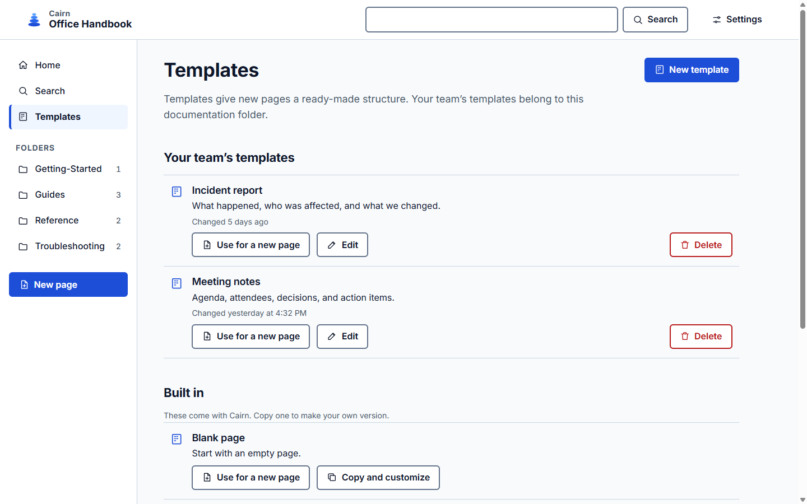
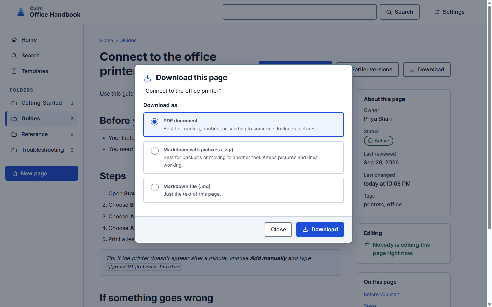
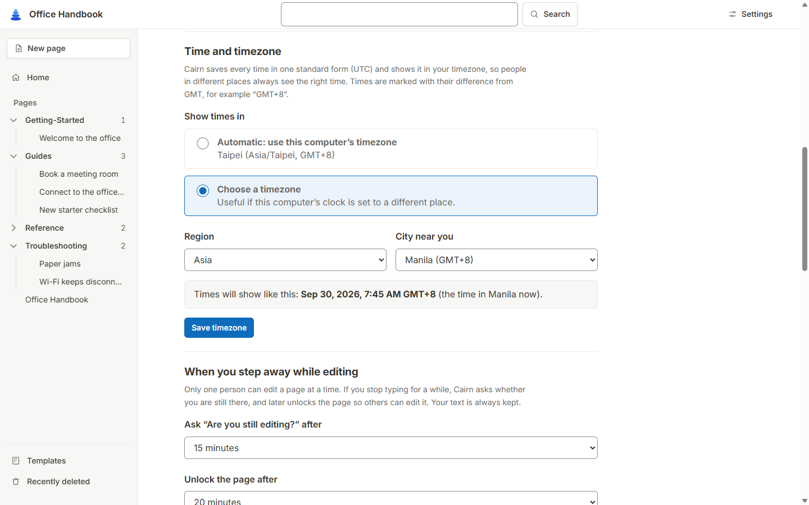

# Cairn

Shared documentation in a folder you control.

Cairn lets a team keep documentation as ordinary Markdown files in a folder on a computer or a shared network drive. Each person runs Cairn on their own computer; it opens the documentation in their normal web browser. There is no server to maintain, no accounts, no cloud service, and nothing is sent over the internet. If you stop using Cairn, your documentation is still just a folder of `.md` files and pictures that any text editor can open.

Cairn is designed to be easy for everyone on a team, including people who don't use much software:

- Every button has words on it. Nothing is hidden behind icons, hamburger menus, or keyboard shortcuts.
- You can write and format a page without knowing Markdown: toolbar buttons such as **Heading**, **Bullet list**, **Link…**, and **Insert picture…** do it for you, and a live preview shows how the page will look.
- Text can be made larger in Settings, and the layout adapts to any window size, from a full desktop screen to half a screen or a phone. There are Light, Dark, and High contrast color schemes.
- Messages use plain words and always say what to do next.

## What it does

- **Read and search** pages, with a table of contents, owner, status, and last-reviewed date for each page.
- **Edit safely.** One person edits a page at a time. Others see “Being edited by Alex since 2:30 PM” and can keep reading.
- **Never lose work.** Unsaved changes are kept privately on your own computer every few seconds. If someone changed the page while you were writing, Cairn shows both versions instead of overwriting either one.
- **Pictures** by button, paste, or drag and drop. They are stored next to the page in a normal folder.
- **Earlier versions** of every page are kept and can be restored.
- **Rename, move, and delete** pages and folders. Links between pages are updated for you, and anything deleted can be brought back from **Recently deleted**.
- **Team templates** for pages you write often, kept with each documentation folder, with fields such as the title and today's date filled in for you.
- **Download** a page as PDF or Markdown, or a whole folder or all documentation as a .zip. PDFs are made on your own computer.
- **Your timezone.** Times are stored in one standard form and shown in each person's timezone, marked like “2:30 PM GMT+8”.

## Quick start

1. Download the latest `cairn-…-windows-x64.zip` from the [Releases page](https://github.com/thekovie/cairn/releases/latest) and unzip it. (Or build it yourself: see [Building cairn.exe](docs/building.md).)
2. Double-click `cairn.exe`. A small window opens and your browser shows Cairn.
3. Choose **Create a new documentation folder** (or **Open a documentation folder we already use**).
4. Choose **New page**, give it a title, and start writing. Choose **Publish changes** when you're done.

Keep the small Cairn window open while you use Cairn. Closing it stops Cairn.

The full walkthrough is in [docs/getting-started.md](docs/getting-started.md).

## Screenshots

The home screen: folders, search, and recently changed pages.

A page, with its owner, status, review date, and editing state beside it.

Visual editing: write on the page as it will look. Markdown shortcuts such as `## ` and `- ` format as you type.

Or write Markdown with a live preview beside it. Point at a toolbar icon to see its name.

More screenshots: templates, downloads, and timezones

Team templates, kept with each documentation folder.

Download a page as a PDF or as Markdown.

Choose the timezone times are shown in.

The screenshots use made-up sample content.

## Documentation

| Guide | What it covers |
| --- | --- |
| [Getting started](docs/getting-started.md) | Installing, opening or creating a documentation folder, your first page |
| [Writing pages](docs/authoring.md) | Formatting, pictures, unsaved changes, publishing, earlier versions |
| [Architecture](docs/architecture.md) | How the local program, the browser, and the files fit together |
| [Storage and concurrency](docs/storage-and-concurrency.md) | The marker file, edit locks, time-outs, conflicts, recovery, and filesystem limits |
| [Configuration](docs/configuration.md) | Settings and the workspace file format |
| [Troubleshooting](docs/troubleshooting.md) | Shared-folder access, failed publishing, abandoned locks, restoring unsaved changes |
| [Two-computer test checklist](docs/manual-two-computer-checklist.md) | Manual checks for network-share behavior |
| [Building cairn.exe](docs/building.md) | Step by step: from a new Windows computer to your own `cairn.exe` |
| [Contributing](CONTRIBUTING.md) | Running, testing, and working on the code |
| [Changelog](CHANGELOG.md) | What changed in each release |

## Limitations

- **Windows first.** This release is built and tested on Windows 10/11. The code is written to be portable, but other systems are untested.
- **Edit locks need suitable storage.** Locks and safe replacement rely on exclusive file creation and atomic rename, which Windows (NTFS) and SMB2/SMB3 network shares provide. Cloud-synced folders (OneDrive, Dropbox, Google Drive) and some network storage do not. Cairn checks the storage when a folder is opened and warns when editing by several people at once is not safe. See [storage and concurrency](docs/storage-and-concurrency.md).
- **Cairn only knows about Cairn.** If someone edits a `.md` file directly in another program, Cairn can't show them as the editor. It does notice the change when someone tries to publish, and shows a comparison instead of overwriting.
- **Access control is the filesystem's job.** Cairn hides editing where you can't write, but the real protection is the shared folder's own permissions.
- **Pictures:** PNG, JPEG, WebP, and GIF only. SVG is not accepted.
- **No viewer presence.** Cairn does not show who is currently reading a page.
- **Unsigned download.** `cairn.exe` is not code-signed, so Windows SmartScreen may warn the first time you run it. Choose **More info → Run anyway**, or check the file against the `.sha256` published next to it.

## License

[MIT](LICENSE). The bundled Inter font is under the SIL Open Font License (`assets/fonts/Inter-LICENSE.txt`).
